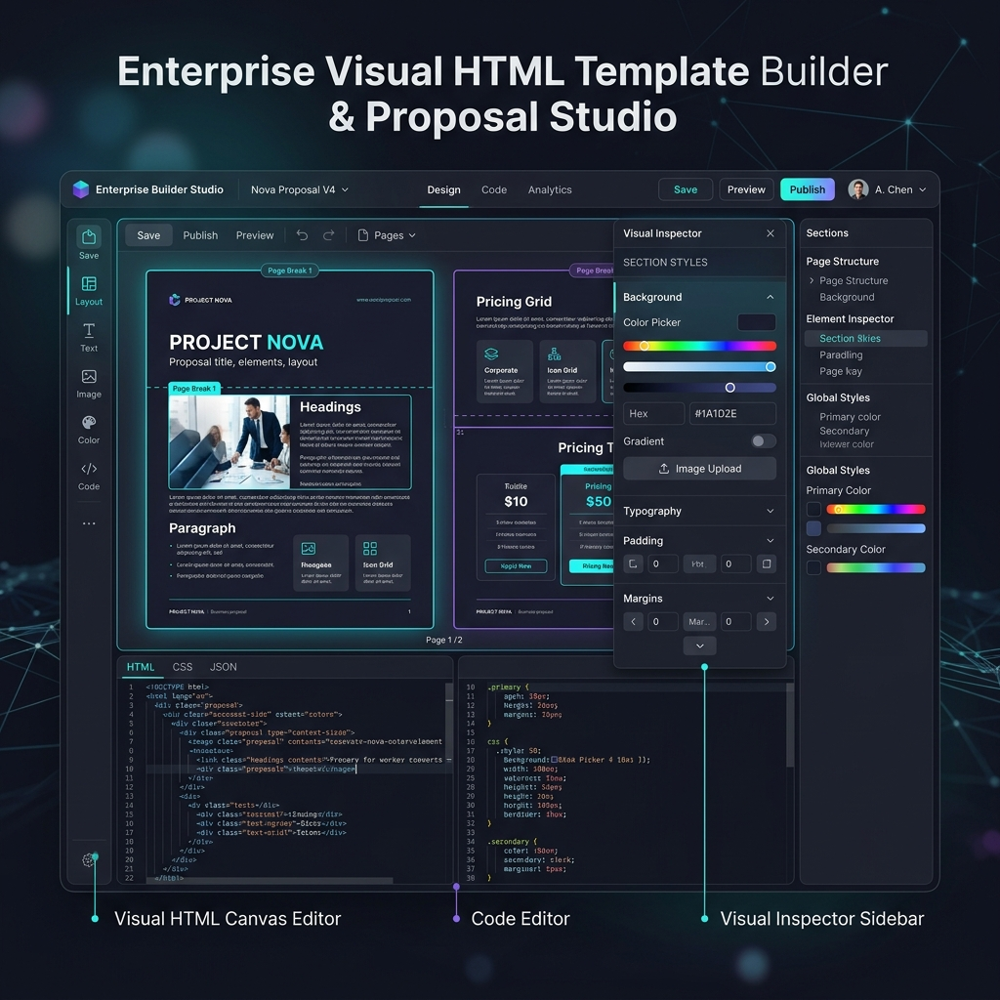
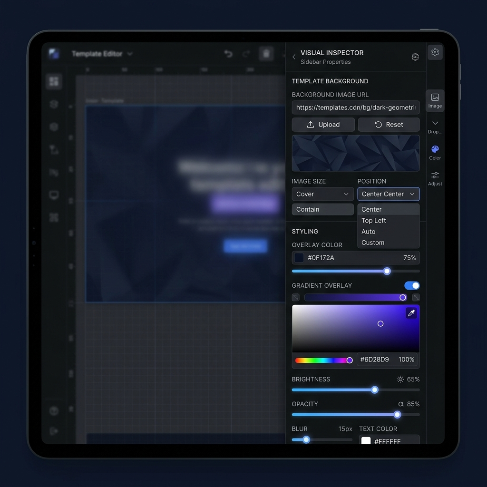
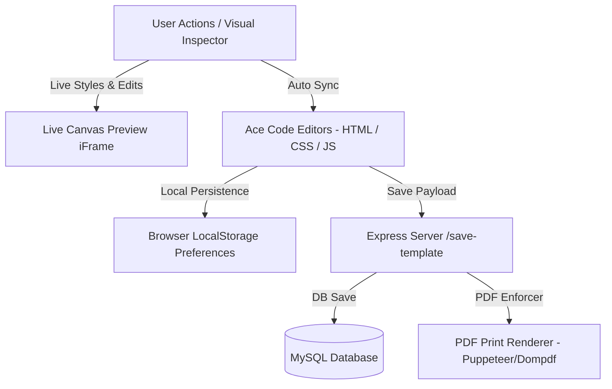

# 🚀 Own Builder - Enterprise Visual Template & Proposal IDE

<p align="center">
  
</p>

<p align="center">
  
  
  
  
  
</p>

---

## ✨ Overview

**Own Builder** is a modern, high-performance visual template builder and IDE for constructing invoices, business proposals, letters, contracts, certificates, and web components. 

It seamlessly bridges the gap between **No-Code visual building** and **Full-Code inspection**, offering a live drag-and-drop / click-to-edit canvas alongside dual Ace Code Editors (HTML, CSS, JavaScript) with real-time syncing.

---

## 🎨 Visual Inspector & Design System Showcase

<p align="center">
  
</p>

### 🛠️ Key Capabilities & Features

#### 1. 🎨 Advanced Visual Inspector (No-Code & Low-Code)
* **Direct Click-to-Edit & In-Canvas Editing**: Click any element on the canvas to inspect and edit style properties. Double-click any text or heading to edit text right in place with a glowing focus ring.
* **Inline Floating Action Toolbar**: A floating mini bar appears right above selected canvas elements for fast operations: `Move Up/Down`, `Select Parent`, `Add Block`, `Clone`, `Delete`, and `Full Code Inspector`.
* **DOM Breadcrumbs Hierarchy**: Easily select parent containers using the live element hierarchy bar (`table > tbody > tr > td`).
* **Sub-Tab Style Controls**:
  * 🎨 **Style**: Text typography, font sizes, weights, alignments, text colors, brand swatches, padding, and margins.
  * 🌄 **Background**: Custom background images (`background-image: url(...)`) on ANY element (`<th>`, `<td>`, `<div>`, `<table>`, `<body>`, etc.) with full custom size (`100% 45px`, `cover`, `contain`), position (`center -10px`, `top left`), repeat, attachment, and gradient presets.
  * 🖼️ **Border & Radius**: Individual corner border radius sliders, border styles, widths, colors, and outlines.
  * ✨ **Shadows**: Box shadows, text shadows, neon text effects, and custom shadow offsets.
  * 💡 **Effects**: Opacity, CSS blur, brightness, grayscale, rotate, and scale transforms.
  * 📐 **Layout**: Display modes (`flex`, `grid`, `block`), flex direction, justify content, width, and height.
  * ⚙️ Media/Link: Image `src` attributes, link `href` targets, element IDs, and class lists.

---

#### 🌄 2. Custom Background Engine (For Any Element)
* **Background Image URL**: Apply background images to table headers, cells, table rows, cards, or body sections.
* **⚙️ Custom Background Size**: Select standard options (`cover`, `contain`, `100% 100%`, `auto`) or choose **`⚙️ Custom Size`** to enter exact dimensions like `100% 45px`, `350px 60px`, `contain 90%`, etc.
* **⚙️ Custom Position**: Choose presets or select **`⚙️ Custom Position`** (`center -10px`, `top left`, `right 10px top 5px`, etc.).
* **Image Thumbnail Card**: Instant visual thumbnail preview with a 1-click **Remove Background Image** button.

---

#### 📄 3. PDF Print-Ready Optimization Engine
* **Automatic `@media print` Enforcer**: Automatically injects `-webkit-print-color-adjust: exact !important; print-color-adjust: exact !important;` into template stylesheets. Guarantees background images, background colors, and card gradients are never stripped when converting to PDF via Puppeteer, Dompdf, mPDF, or wkhtmltopdf.
* **📄 1-Click PDF Preview**: Dedicated navbar button opening a print/PDF view preview in a new tab.
* **PDF Page Break Controls**: Apply `page-break-inside: avoid` (prevent table row / card splitting in PDF) and `page-break-before: always` directly from the inspector layout panel.
* **Visual A4 Page Break Guidelines**: Dotted visual markers calculated at exact A4 height splits (`1123px`).

---

#### 🎨 4. Global Domain Branding Integration
* **Top Toolbar Integration**: Click **`🎨 Global Branding`** to access domain branding variables connected to `/api/global-branding-settings`.
* **1-Click Theme Application**: Inject your domain's `:root { --brand-primary: ...; --brand-secondary: ...; --brand-font: ...; }` variables into the template CSS with 1 click.
* **Brand Color Swatches**: Quick `🎨 Brand Primary` and `🎨 Brand Secondary` chips under text color, background color, and border color pickers.

---

#### 🔍 5. Component Code Inspector Modal (`#expanded-code-modal`)
* **Dual Ace Code Editors**: View and edit component HTML and CSS side-by-side in a 1340px IDE modal.
* **Associated CSS Extraction**: Automatically extracts inline and stylesheet CSS rules for the selected element **and all descendant child elements**.
* **Automatic CSS Cleanup**: Automatically purges orphan CSS rules when elements are deleted from the view.

---

#### 💾 6. Persistent Workspace State (`localStorage`)
* Remembers your exact workspace layout across browser refreshes:
  * Active Editor Tab (`HTML`, `CSS`, `JavaScript`, `Split Stack`)
  * Code Panel Visibility (`Show Code` vs `Hide Code`)
  * Click-to-Edit Mode (`ON` vs `OFF`)
  * Layers Tree Drawer State (`Open` vs `Closed`)
  * A4 Guides Toggle (`ON` vs `OFF`)
  * Device Viewport (`Full`, `A4 Page`, `Mobile`)
  * Syntax Theme (`One Dark`, `Monokai`, `Dracula`, `Tomorrow Night`)

---

## 🔄 Architecture & Data Flow



---

## 🚀 Quick Start & Installation

### Prerequisites
* **Node.js**: v16.x or higher
* **MySQL Database**: v5.7 / v8.0 or MariaDB

### Setup Instructions

1. **Clone the Repository**:
   ```bash
   git clone https://github.com/Haris-khan-Durrani/Own-builder.git
   cd Own-builder
   ```

2. **Install Dependencies**:
   ```bash
   npm install
   ```

3. **Configure Environment Variables**:
   Create a `.env` file in the root directory:
   ```env
   PORT=4002
   DB_HOST=localhost
   DB_USER=root
   DB_PASS=your_password
   DB_NAME=your_database
   JWT_SECRET=your_jwt_secret
   ```

4. **Start the Application**:
   ```bash
   npm start
   # or
   node app.js
   ```

5. **Access the Application**:
   Open `http://localhost:4002` in your browser.

---

## 🔌 API Endpoints Reference

| Endpoint | Method | Description |
| :--- | :--- | :--- |
| `/edit-template` | `GET` | Render the Visual Builder IDE for a template ID |
| `/save-template` | `POST` | Save HTML, CSS, and Custom JS changes for a template |
| `/api/global-branding-settings/:domain_id` | `GET` | Fetch global brand colors, font family, and logo URL |
| `/api/global-branding-settings/save` | `POST` | Update global domain branding settings in database |

---

## 📄 License & Author

Developed by **Haris Khan Durrani** for the **Own Builder** Suite. All rights reserved.
